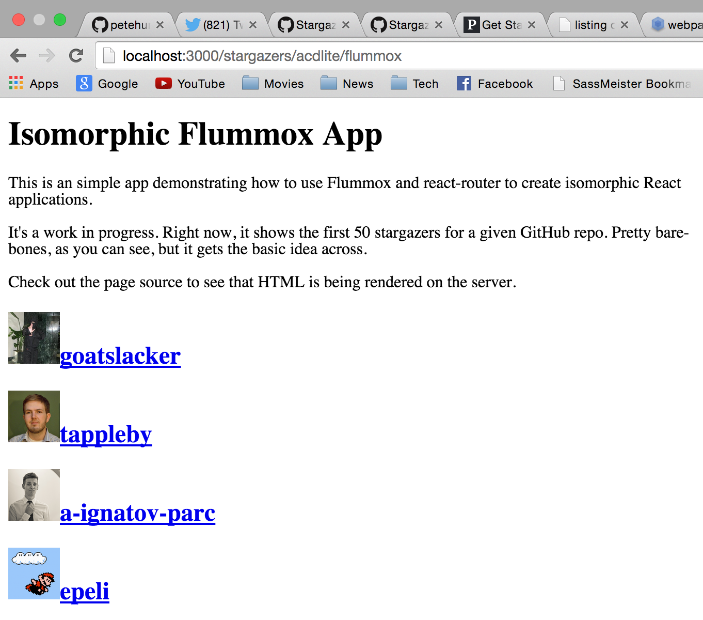

# Flummox Isomorphic Demo

**Very much a work in progress**

Demo of how to create isomorphic apps using Flummox and react-router. Fetches and displays the stargazers for a given GitHub repo. The server does the initial render and sends the HTML to the client, where it continues. (This was the easiest, quickest example I could think of.)

Needs more work, but it should get the basic idea across until I find time to make it better. Pull requests definitely welcome :)



## Tools/technologies used:

- Flummox
- React
- react-router
- webpack
- react-hot-loader
- koa
- iojs
- superagent
- 6to5
- jade
- make

...and more

## Start the app

Clone this repo, then run

```
$ npm install
$ npm install -g nodemon
$ make watch
```

to start a dev server (with hot reload enabled) on port 3000. Then navigate to http://localhost:3000/stargazers/acdlite/flummox (or any url of the form `/stargazers/:owner/:repo`)

Make sure you're running on iojs, for generator support
